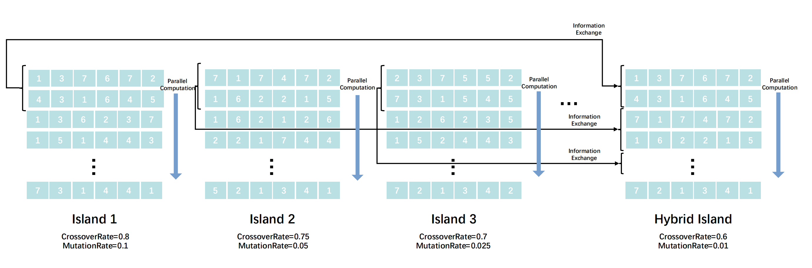
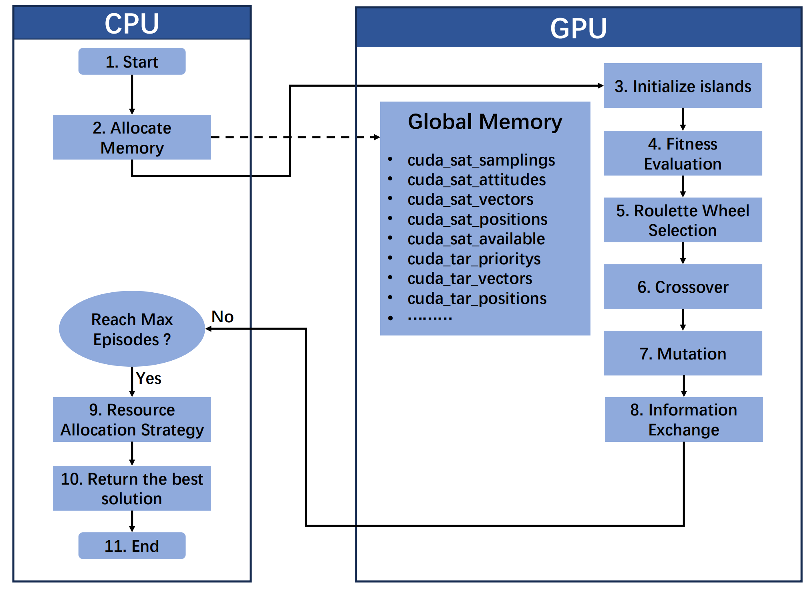

# PIDEA
Parallel Island Differential Evolutionary Algorithm (PIDEA) for multi-satellite mission scheduling


### :bulb: Multi-Satellite Scheduling for Moving Targets Tracking Using Parallel Island Differential Evolutionary Algorithm (under review)

<p align="center">

</p>

### keyword
Satellite Scheduling, Evolutionary Algorithms, Reinforcement Learning, Attitude Control, Intelligent satellite systems, GPU accelerated applications.


> Abstract: The tracking of moving targets using satellite constellations presents significant challenges due to the need for time-sensitive and effective scheduling solutions.
While static target observation has been extensively studied, stereo tracking of moving targets remains a critical research gap, particularly when considering the complexities introduced by real-time movement and operational constraints.
To address these challenges, this paper proposes a pioneering approach that integrates stereo tracking with a Parallel Island Differential Evolutionary Algorithm (PIDEA) for multi-satellite mission scheduling. The PIDEA harnesses the computational power of Graphics Processing Units (GPUs) and employs island evolution strategies to balance computational efficiency with solution diversity, ensuring timely and effective scheduling in dynamic scenarios.
Additionally, a reinforcement learning-based attitude control system is introduced to enable agile satellites to maintain accurate and stable tracking of moving targets, even under challenging conditions.
To further enhance operational adaptability, we incorporate event-driven mechanisms to dynamically trigger rescheduling when significant changes occur, such as satellite availability or energy constraints.
Extensive experiments conducted in multiple moving target tracking scenarios demonstrate the effectiveness and efficacy of the proposed method. 
The results validate its ability to generate near-optimal scheduling solutions that meet the dual demands of time sensitivity and tracking effectiveness, marking a significant step forward in autonomous satellite mission planning for dynamic environments.


<p align="center">

</p>

## Getting started
#### <a id="Step1">Step 1</a>: Modify algorithm parameters in METADATA.
#### <a id="Step2">Step 2</a>: Adjust the inputs of [iea_kernel](task_allocation.py)  and fitness evaluation function base on your own mission requirements.
```.bash
python task_allocation.py

